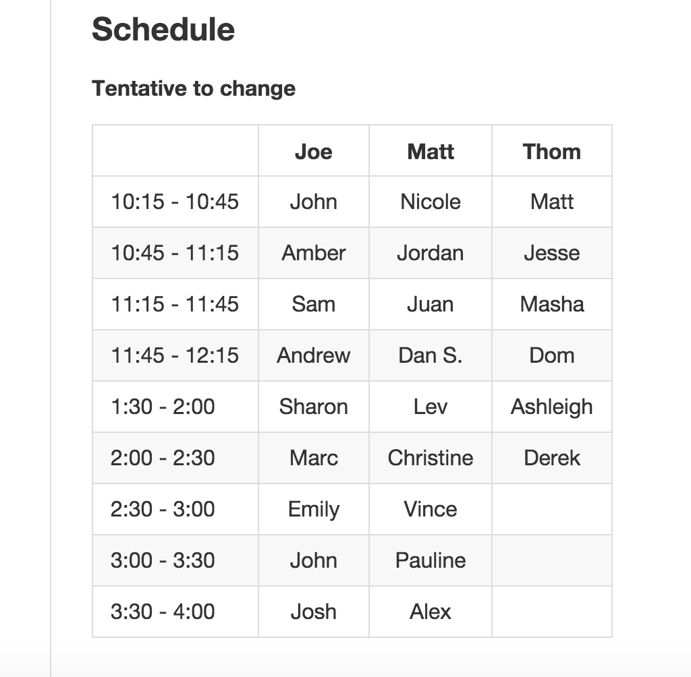

# Project 1 - Mid Project Retro
##### Retro's should take 15 - 30 mins max.

##### These are intended to ensure you have direction and are properly managing time.

##### NOT INTENDED TO SOLVE YOUR PROBLEM but provide direction.

### Send the following via email or slack to your appointed instructor...

----- 
ANSWER IN WORDS...NOT CODE!

- List your MVP criteria

- What have you gotten done so far?

- What aspects of your approach/attitude so far have been the hardest?

- What are your next steps for today (End of Day Objectives) as well the weekend in order to accomplish your MVP?

